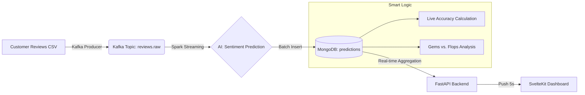

# 🚀 Amazon Reviews: Real-Time Sentiment Analysis Platform

**A comprehensive, scalable Data Engineering system for emotional analysis of Amazon customer reviews, combining Streaming, Machine Learning, and Business Intelligence.**

---

## 🧭 Focus: Business Logic & Smart Insights
Unlike traditional dashboards, this system leverages AI to extract real customer satisfaction beyond simple "star" ratings.

### 🏆 Recommendation System (Gems vs. Flops)
The **Smart Insights** tab calculates product performance in real-time:
- **Satisfaction Rate**: Calculated as `(Positive Reviews / Total) * 100`.
- **Top 10 Recommended (Gems)**: Products with the highest satisfaction rates, filtered for a minimum of **3 reviews** (Confidence Index).
- **Quality Alert (Flops)**: Products suffering from high textual disappointment rates, allowing sellers to act before the average star rating drops.

### 🧠 Live Accuracy (Quality Audit)
The system constantly compares AI predictions with human ratings (1-5 ⭐) to calculate **Real-Time Accuracy**, enabling model health monitoring without waiting for weekly reports.

---

## 🛠️ Technology Stack

| Layer | Technologies |
| :--- | :--- |
| **Ingestion & Streaming** | Apache Kafka, Zookeeper |
| **Distributed Processing** | Apache Spark (PySpark), Spark Streaming |
| **Artificial Intelligence** | Logistic Regression (MLlib), NLTK, TF-IDF |
| **Database** | MongoDB (NoSQL) |
| **Backend & API** | FastAPI (Python), REST, SSE (Server-Sent Events) |
| **Frontend UI** | SvelteKit, TailwindCSS, Chart.js, Lucide Icons |
| **Orchestration** | Apache Airflow |
| **Containerization** | Docker & Docker Compose |

---

## 🏗️ Pipeline Architecture



---

## 🚀 Quick Start

### 1. Prerequisites
- Docker & Docker Compose installed.
- Minimum 8GB RAM allocated to Docker.

### 2. Infrastructure Setup
```powershell
# Clone and launch
git clone <your-repo-url>
cd Amazon-reviews-analysis
docker-compose up -d
```

### 3. Launch AI Pipeline
```powershell
# Preprocess data (Split Train/Test)
docker-compose --profile preprocessing up preprocessing-job

# Start real-time analysis
docker-compose start streaming-job

# Start review ingestion
docker-compose restart reviews-producer
```

### 4. Access Interfaces
- **Dashboard**: [http://localhost:5173](http://localhost:5173)
- **API Documentation**: [http://localhost:8000/docs](http://localhost:8000/docs)
- **Kafka UI**: [http://localhost:8090](http://localhost:8090)
- **Mongo Express**: [http://localhost:9090](http://localhost:9090)

---

## 📸 Key Features

- **Live Monitor**: Continuous feed of reviews with immediate AI sentiment prediction.
- **Smart Insights**: Dynamic ranking of best and worst products (Auto-refresh every 5s).
- **Model Insights**: Technical metrics (Accuracy, Recall, F1-Score) calculated in real-time.
- **Dark Mode UI**: Modern interface optimized for 24/7 monitoring.

---

## 📁 Project Structure
- `/spark`: Streaming and preprocessing jobs.
- `/api`: FastAPI backend optimized for MongoDB.
- `/frontend`: SvelteKit dashboard (Premium UI/UX).
- `/kafka`: Data producer for real-time flow simulation.
- `/airflow`: Orchestration DAGs for daily reporting.

---
*Project developed as an End-to-End Data Engineering pipeline.*
