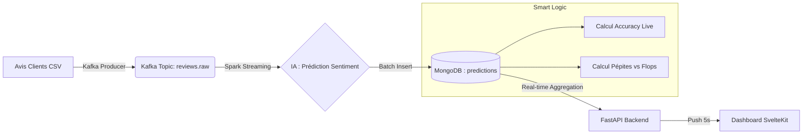

# 🚀 Amazon Reviews : Plateforme d'Analyse de Sentiment Temps Réel

**Un système de Data Engineering complet et scalable pour l'analyse émotionnelle des avis clients Amazon, combinant Streaming, Machine Learning et Business Intelligence.**

---

## 🧭 Focus : Business Logic & Smart Insights
Contrairement aux tableaux de bord classiques, ce système utilise l'IA pour extraire la satisfaction réelle, au-delà des simples notes "étoiles".

### 🏆 Système de Recommandation (Pépites vs Flops)
L'onglet **Smart Insights** calcule en temps réel la performance des produits :
- **Satisfaction Rate** : Ratio (Avis Positifs / Total) * 100.
- **Top 10 Recommandés (Pépites)** : Produits ayant le taux de satisfaction le plus élevé, filtrés pour avoir **au moins 3 avis** (Indice de confiance).
- **Quality Alert (Flops)** : Produits subissant un fort taux de déception textuelle, permettant aux vendeurs d'agir avant que la note moyenne ne chute.

### 🧠 Accuracy Live (Audit Qualité)
Le système compare en permanence la prédiction de l'IA avec la note humaine (1-5 ⭐) pour calculer une **Accuracy en temps réel**, permettant de surveiller la santé du modèle sans attendre les rapports hebdomadaires.

---

## 🛠️ Stack Technologique

| Couche | Technologies |
| :--- | :--- |
| **Ingestion & Streaming** | Apache Kafka, Zookeeper |
| **Traitement Distribué** | Apache Spark (PySpark), Spark Streaming |
| **Intelligence Artificielle** | Logistic Regression (MLlib), NLTK, TF-IDF |
| **Base de Données** | MongoDB (NoSQL) |
| **Backend & API** | FastAPI (Python), REST, SSE (Server-Sent Events) |
| **Frontend UI** | SvelteKit, TailwindCSS, Chart.js, Lucide Icons |
| **Orchestration** | Apache Airflow |
| **Conteneurisation** | Docker & Docker Compose |

---

## 🏗️ Architecture du Pipeline



---

## 🚀 Lancement Rapide (Quick Start)

### 1. Pré-requis
- Docker & Docker Compose installés.
- 8 Go de RAM minimum alloués à Docker.

### 2. Démarrage de l'infrastructure
```powershell
# Cloner et lancer
git clone <votre-repo>
cd Amazon-reviews-analysis
docker-compose up -d
```

### 3. Lancer le Pipeline IA
```powershell
# Pré-traiter les données (Split Train/Test)
docker-compose --profile preprocessing up preprocessing-job

# Lancer l'analyse en continu
docker-compose start streaming-job

# Lancer l'envoi des avis
docker-compose restart reviews-producer
```

### 4. Accès aux interfaces
- **Dashboard** : [http://localhost:5173](http://localhost:5173)
- **API Documentation** : [http://localhost:8000/docs](http://localhost:8000/docs)
- **Kafka UI** : [http://localhost:8090](http://localhost:8090)
- **Mongo Express** : [http://localhost:9090](http://localhost:9090)

---

## 📸 Aperçu des Fonctionnalités

- **Live Monitor** : Flux continu des avis avec prédiction immédiate de l'IA.
- **Smart Insights** : Classement dynamique des meilleurs et pires produits (Rafraîchissement auto toutes les 5s).
- **Model Insights** : Métriques techniques (Précision, Recall, F1-Score) calculées en temps réel.
- **Dark Mode UI** : Interface moderne optimisée pour la surveillance 24/7.

---

## 📁 Structure du Projet
- `/spark` : Jobs de streaming et de preprocessing.
- `/api` : Backend FastAPI optimisé pour MongoDB.
- `/frontend` : Dashboard SvelteKit (UI/UX Premium).
- `/kafka` : Producteur de données pour simuler le flux réel.
- `/airflow` : DAGs d'orchestration pour les rapports quotidiens.

---
*Projet réalisé dans le cadre d'un pipeline de Data Engineering End-to-End.*
